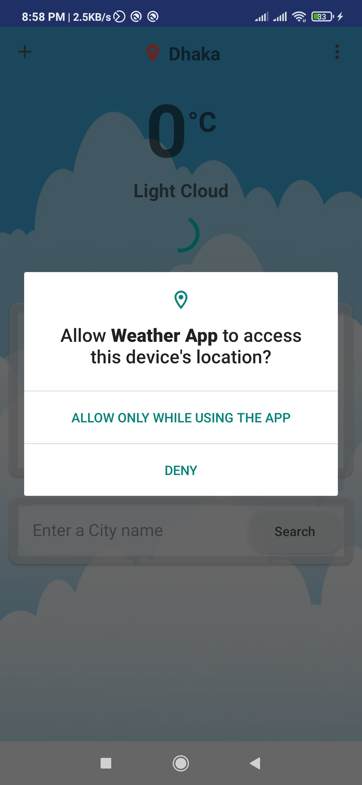
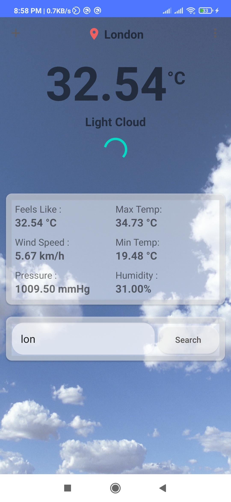
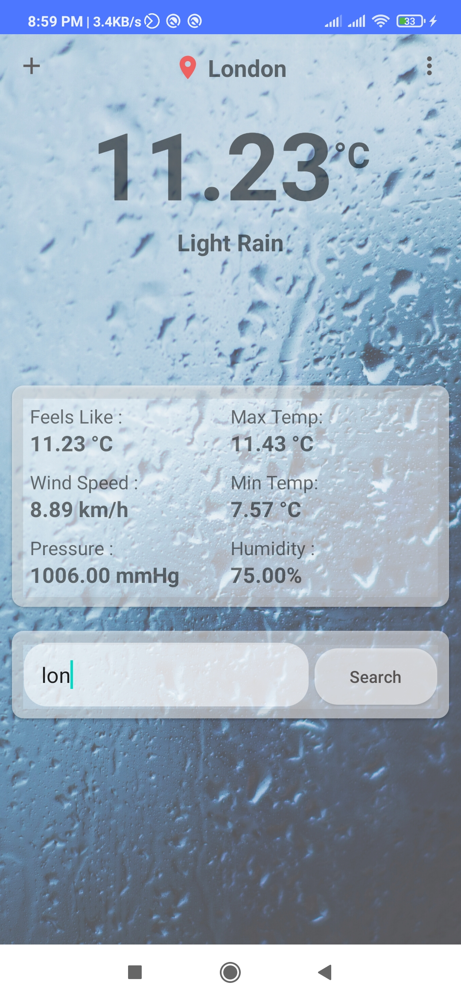

# Weather App
This is an weather app where I have use retrofit for collecting data via API. All weather information is automatically updated from https://www.metaweather.com/ site. Work fine in offline If you just connect this app internet first time. Also you can check the last updated time of weather info.

## Download APK:

https://terabox.com/s/1xoif6SHcq025PImbFryV2A

## Screenshots:

### 01. APP UI

### 02. APP UI

### 03. APP UI

### 04. APP UI

### Disclaimer
This project is made only for educational purpose. Anyone can use it but the risk has to be taken by the user.
for any query please contact me.

### Repository Owner Info

__Md. Al-Amin__  
__Email :__ [ alamin.karno@outlook.com ](mailto:alamin.karno@outlook.com)  
__Github :__ [Md. Al-Amin](https://github.com/karno786) 
__Facebook :__ [মোঃ আল-আমিন খন্দকার কর্ণ](https://facebook.com/alamin.kanro786)  
__Linkedin :__ [Md. Alamin Karno](https://www.linkedin.com/in/alaminkarno/)
 
 
